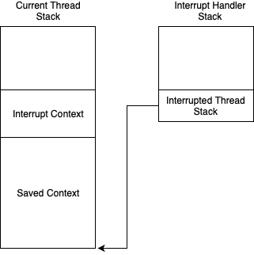

# Design

## Overiew

## Goals

* Simplified tool chain
  * Java compiler
  * Java JRE
  * Java utilities
* Metacircular; all Java code
* Adaptive optimization
* Self optimizing/tuning
* Small
* Push/pull class/method loading
* Application security
* Application safety
* Scalable
* Java interface to hardware
* Self hosting
* Fast build times
* Easy configuration

## Components

JOE consists of the following major components: JikesRVM, boot-image-write, MMTK, GNU Classpath, and JAM (Java-on-Any-Machine).

### JikesRVM

Contains the JikesRVM code which includes the compilers, classloader, assemblers, processor architecture, library interfaces, vm magic, runtime, scheduler, and object model classes. These classes are located in jikesrvm-hg/rvm/.

### MMTK

This component provides the memory management subsystem for JikesRVM. The code is located in jikesrvm-hg/MMTK/src/.

### boot-image-writer

The boot-image-writer is a Java program that builds a mockup of the JikesRVM in another JVM that we will call the source JVM. The program acts an object-model translator. It takes the JikesRVM objects running in the source JVM object model and translates them to the JikesRVM object model. When the mockup and translation is complete, the new JikesRMV objects are written into a bootable image that can run on processor. This code is located in jikesrvm-hg/tools/bootImageWriter/src.

### GNU Classpath

This component is an implementation of Java’s standard library and is located in classpath-0.98/.

### JAM

This component contains the computer hardware and processor interfaces and is located in jam/.

## Design Aspects

### Boot Image Layout

### CPU Modes

All software runs at the highest privilege. Application security and protection is enforced through the programming language. This simplifies the design of the OS components and increases the overall system performance.

### Interrupt Handling		
All interrupt handlers must provide their own stack. When an interrupt handler is called, the current thread's stack will be switched over to the interrupt handler's stack. The interrupted thread's context is saved on its own stack. The interrupt handling methods need to be annotated with @InterruptHandler. This specifies to the compiler that there is no method prologue setup and the method epilogue should end with an interrupt return instruction. The interrupt handling needs to save the current context, switch to the interrupt handler stack, process the interrupt, and then restore the interrupted context. The `org.jam.cpu.intel.Idt` class is where all the interrupts are setup and processed. Methods `int48()`, `int32()`, and `int36()` are examples of how an interrupt can be processed.

